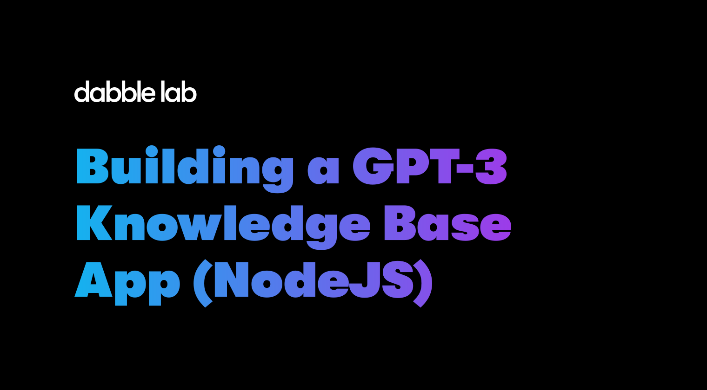

# Building a GPT-3 Knowledge Base App (NodeJS)

This is code for building a GPT-3 powered knowledge base application using Node.JS/JavaScript. It's and example from the book [Exploring GPT-3](https://www.amazon.com/dp/1800563191). To deploy and run this code you'll need the following:

- An OpenAI API key
- An account on Replit.com (the free account will work)

## Deploying the code

1. Click the 'Run on Replit.com' button below to copy this code to your Replit.com account.

    

2. In Replit.com, click the padlock icon on the left-side menu and add a new secret / environment variable named `OPENAI_API_KEY` and make the value your OpenAI API key. 

## Running the application

After your OpenAI API key is set as an environment variable, you can just click the `Run` button in the Replit.com IDE. 
